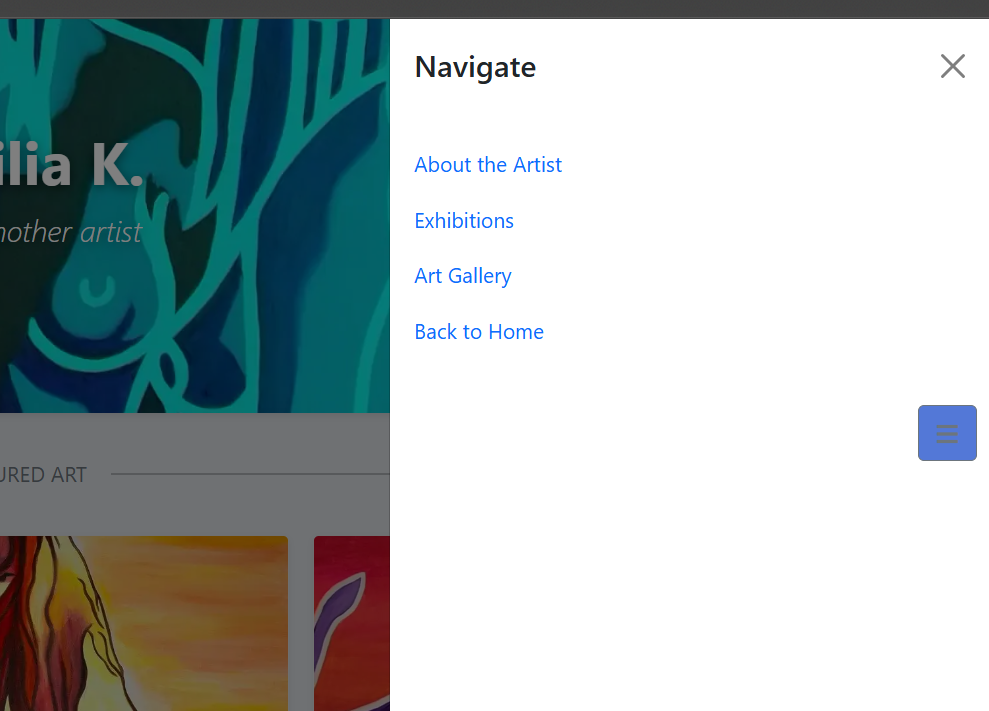

# Constcollection

A Django Hackathon project.

[Link to deployed site](https://hackathon-constcollection-e94b800f4c67.herokuapp.com/)

[Link to the project GitHub](https://github.com/users/SourTarte/projects/7/views/1)

[Link to project KanBan](https://github.com/users/SourTarte/projects/7)

Constcollection is a student Hackathon project whose premise is to create a responsive, accessible website for the artist Cecilia Kristoffersson.

# Table of Contents

- [User Experience and Design](#user-experience-and-design)
    - [Agile Methodology](#agile-methodology)
    - [Entity Relationship Diagram (ERD)](#entity-relationship-diagram-erd)
    - [Wireframes](#wireframes)
    - [Colour](#colour)
    - [Fonts](#fonts)
- [Features](#features)
    - [Admin](#admin)
    - [Navbar](#navbar)
    - [Footer](#footer)
- [Technologies Used](#technologies-used)
- [Deployment](#deployment)
- [Testing](#testing)
    - [Manual Testing against User Stories](#manual-testing-against-user-stories)
    - [Code Validation](#code-validation)
    - [Lighthouse Testing](#lighthouse-testing)
- [Bugs](#bugs)
- [Future Features](#future-features)
- [Use of AI](#use-of-ai)
- [References and Credits](#references-and-credits)

# User Experience and Design

The site goal is to create a responsive, accessible website that showcases the art of Swedish artist Cecilia Kristoffersson. This minimalist site is intended to focus the users' attention on the works created by Cecilia, while also offering additional pages to learn more about the artist, their collections and exhibitions.

The site allows the artist to upload, modify, and delete works through the front end of the site without needing access to the Django admin panel.

Future versions of the site would include avenues for direct sale of available works by the artist, thought that functionality is not intended for the initial version of the site.

## Agile Methodology ##

Development follows the principle of Agile development. The project KanBan board can be found here:

[Link to project KanBan](https://github.com/users/SourTarte/projects/7)

## Entity Relationship Diagram (ERD) ##

Here we have a Media model, which holds any images or videos the artist wants to display on the site. For the MVP we focused on displaying images foremost, but wanted to have the capability of storing videos later. The Media model had a clean method that only allowed either a video or an image, but not both and not neither. This is so one Media object only references one piece of media. 

The Category model stores information about the 'types' of art the artist paints. She had several different categories with explanations of this, stored in the information field. One category could be linked to many pieces of media.

The AboutSection model stores information on exhibitions, the artist's biography, and any press information - essentially information that is not directly linked to pieces of art. The AboutSection has a many to many relationship with media, so that for example, a section on an exhibition can inlude art pieces, photos, or videos of the event. 

The ERD needed no reference to the User model - none of the objects were linked to a user. We only have one or two users - the artist or curator who wants to update the site.

## Wireframes ##

Mobile:

Desktop:

## Colour ##

The blue (#2f4bbd) for the header/footer was taken from Cecilia Kristoffersson's artwork "Blue". A lighter blue gradient compliments on the background.

The image below was taken using the Coolors.co website, though the site was not used in the process of selecting these colours.

## Fonts ##

For the main header and the footer, the site uses a font-family of 'Chicle' from Google Fonts, with a fallback of 'cursive'.

For h1 and h2 headers, the site uses a font-family of 'Georgia', falling back to serif.

# Features #

Admin panel to add, edit or delete Media, Art Categories, Exhibitions, or About sections.

This has tabs for each form, and the forms are scrollable with buttons to edit or delete existing objects.

There is no functionality to register a user so this is only available to the artist/curator who is given a log in. 

A navigation bar accessible through a toggle on the right, so as to not distract from the art:

Welcome page:

Gallery to display all art pieces:

About the artist:

Exhibitions:

# Technologies Used #

## Languages
- **Python 3** – Main backend language (Django framework)
- **HTML5** – Markup for templates
- **CSS3** – Styling, including Bootstrap classes
- **JavaScript** – For interactive elements (if used)

## Frameworks & Libraries
- **Django** – Main web framework for backend and templating
- **Bootstrap 5** – Responsive front-end framework for layout and components
- **Cloudinary** – Image hosting and management for media files
- **Gunicorn** – WSGI HTTP server for deploying Django on Heroku
- **psycopg2** – PostgreSQL database adapter for Django
- **dj-database-url** – For parsing database URLs from environment variables
- **whitenoise** – For serving static files in production

## Database
- **PostgreSQL** – Production database (hosted on Neon.tech)

## Deployment & Hosting
- **Heroku** – Cloud platform for deployment
- **GitHub** – Version control and project management

## Tools & Services
- **Git** – Version control
- **GitHub Projects** – Kanban board for Agile workflow
- **VS Code** – Main code editor
- **Cloudinary** – Media storage and delivery
- **Django Admin** – For backend content management

## Other
- **pip** – Python package manager
- **venv** – Virtual environment for dependency management

# Deployment #

This project was deployed on Heroku, pulling from GitHub.

#### To enable deployment:  

Ensure all sensitive information, such as your SECRET_KEY and DATABASE_URL, are stored as environment variables and not visible in your project code. Set DEBUG in settings.py to 'False'.

Install requirements.txt - the important installations for deployment are gunicorn for serving the application, and whitenoise for handling static files.  

Add a Procfile at the root of your project, with the content: "web: gunicorn {project_name}.wsgi".  
Add a .python-version file specifying your version of Python.

Add '.herokuapp.com' to ALLOWED_HOSTS within your project's settings.py.  
Add 'https://*.herokuapp.com' to CSRF_TRUSTED_ORIGINS within your project's settings.  

Commit and push your code to GitHub, on the branch you want to deploy from.   

#### To deploy:
Navigate to your Heroku dashboard.  
Create a new Heroku app.  
Select the region closest to you for deployment. 

Generate a secret key to be used with Heroku. This should be a different key to the one used in your project code.    
Go to the settings tab and select Config Vars.  
Add these two keys:  
-- DATABASE_URL : {your_project's_database_url}  
-- SECRET_KEY : {your_secret_key}  

Navigate to the deploy tab.  
Connect to GitHub and select your project repository.  
Select 'Manual Deploy' and choose the branch you want to deploy from.  
Click 'Deploy Branch'.    

# Testing #

All colour contrast meets WCAG AAA 

## Manual Testing against User Stories ##

Significant manual testing was conducted. A comprehensive testing table has not been produced at the time of writing.

## Code Validation ##

All pages passed without note, with the exception of the Admin Panel which had 1 "Info" note.

Home page:

Gallery Page:

About Page:

Exhibitions Page:

Admin Panel:

The Admin Panel had a single "Info" note, about a trailing slash on a single void element.

The code it shows is not present on the VScode project, and appears to be in Django generated code that is then served from the deployed project.

It does not impact on the operation of the web page.

## Lighthouse testing ##
### Desktop ###

### Mobile ###

# Bugs #

### Delete Category button on the gallery page (visible when in Curator Mode) does not work ###

When in "Curator Mode" (when page is viewed by an authenticated user) a "Delete Category" button is visible.

**Intended behaviour** is that clicking on the Delete Category button brings up a Delete Confirmation Modal that allows the user to confirm or cancel. Confirmation should cause the Category to be deleted from the database.

**Issue:** Clicking on the Category Delete buttons does not trigger the appearance of the delete confirmation modal. This means that no deletion takes place - the Category remains in the database and visible on the site.

**Workaround:** Full delete ability for Category remains available through the Admin Panel, so full CRUD ability is still available for Categories.

### Delete Media button on the gallery page (visible when in Curator Mode) does not work ###

When in "Curator Mode" (when page is viewed by an authenticated user) a "Delete Media" button is visible.

**Intended behaviour** is that clicking on the Delete Media button brings up a Delete Confirmation Modal that allows the user to confirm or cancel. Confirmation should cause the Media to be deleted from the database.

**Issue:** Clicking on the Media Delete buttons does not trigger the appearance of the delete confirmation modal. This means that no deletion takes place - the Media remains in the database and visible on the site.

**Workaround:** Full delete ability for Media remains available through the Admin Panel, so full CRUD ability is still available for Media.

### Tab selection changing in Admin Panel when loading Category or Media for editing ###

Admin Panel is split into three tabs: 

**Intended behaviour**

When performing edits to a Category in the the Categories tab or to Media in the the Media tab, after selecting a Category or Media to edit, the page should stay on that tab.

**Issue:** When the "Edit" button is pressed the correct Category or Media is loaded, but the tab jumps to the "About" tab.

**Workaround:** After selecting a Category or Media to edit, simply select the correct tab again. The procedure contiues as intended after this.

### Duplicate Django messages showing in admin panel ###

Django messages are displayed at the top of the page, just beneath the header.

**Intended behaviour**

A single instance of the Django message is displayed at the top of the page.

**Issue:** Two instances of the Django message are displayed at the top of the page, one below the other.

**Workaround:** Close the duplicated message.

# Future Features #

### Add delete confirmation modals to Admin Panel

Currently, all delete operations on the admin panel complete instantly upon the user clicking / pressing delete. There is no warning or confirmation dialog box interrupting the process and giving the user a chance to back out of the delete operation.

This should be the next feature to be implemented, as a delete confirmation is best practice for operation involving Delete functionality.

# Use of AI #

AI in the form of Copilot and GitHub Copilot has been used throughout the development of this project. Uses have primarily been:

- Generation and refinement of User Stories for the project KanBan
- Searching for answers in documentation
- Code generation, including code using Bootstrap and Django Template Language
- Accelerated debugging of code

# References and Credits #

This project is inspired in large part from the "I Think Therefore I Blog" project that is a key part of Code Institutes full-stack web development course.

Copilot uses the collective knowledge of hundreds of millions of people, and has helped create code for this project. 